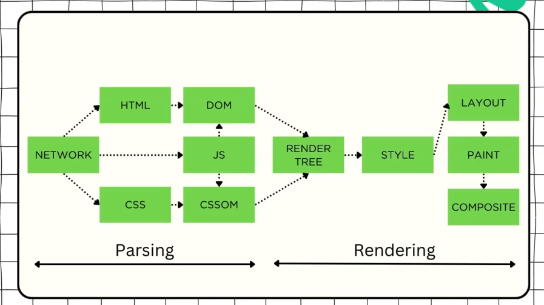

The **Critical Rendering Path (CRP)** is the sequence of steps the browser must perform to convert your HTML, CSS, and JavaScript into pixels on the screen.

We can say that it's mainly divided into two steps **parsing & rendering**.

Note that the JS files can manipulate the DOM & CSSOM trees.
## Parsing

Turns the data received into the **DOM & CSSOM** trees which will be used later by the render stage.

Note that ... the browser starts the parsing even if it hasn't received the full data yet .. so we need the first packet to be optimized as possible to include the necessary parts.

### 1- DOM

The first step is about constructing the DOM tree from the HTML file and this step starts with **tokenization (identifying elements)**.

Note that there might be **render blocking resources** so we will need to optimize this ... and one of the optimizations that's done by the browser to solve this problem is the **preload scanner** and this reduces blockages by scanning the content and request the high-priority resources like CSS, JS before the parser finds them.

### 2- CSSOM

It's very similar to the DOM tree but we won't store the elements only .. we will store the styles also and note that it **begins with general to more specific rules** which means we start with very generic rules like `font-size: 16px` then we go to the specific rules and also note that building CSSOM tree is **very fast process** and also **we won't neglect any element** even if it has `display: none;` for example.

In parallel with building CSSOM tree will be other process running like **JS compilation & building accessibility tree**. (how with only one thread?)

## Rendering

### 3- Render Tree

The first step in rendering is to build the **Render Tree** which will be the combination of the **DOM & CSSOM** tree but here will exist only the nodes that will be shown on the screen.

### 4- Layout

In this step we are concerned with the **calculation of the size and position** of each element ... and note that in this step we **take viewport into consideration**.

Also differentiate between the **layout** which is the first time this process happens and the other concept **Reflow** which is the **subsequent recalculations** of size and position of any node in the page.

### 5- Paint

This step will draw every visual part of an element to the screen.
### 6- Composite

This step determines the right order of the layers on the screen by using information like `z-index`.

