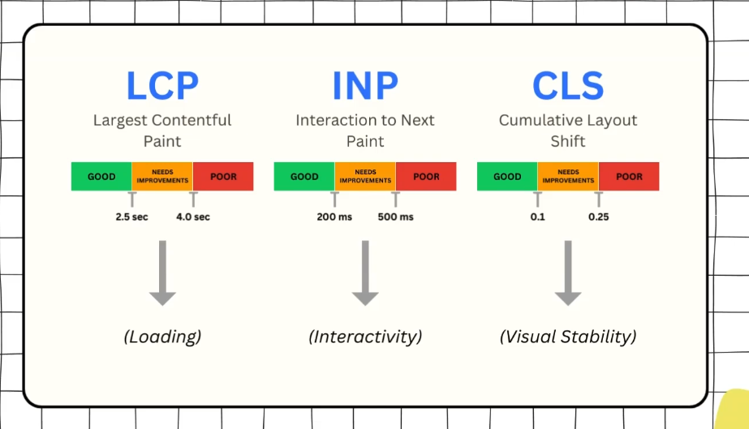
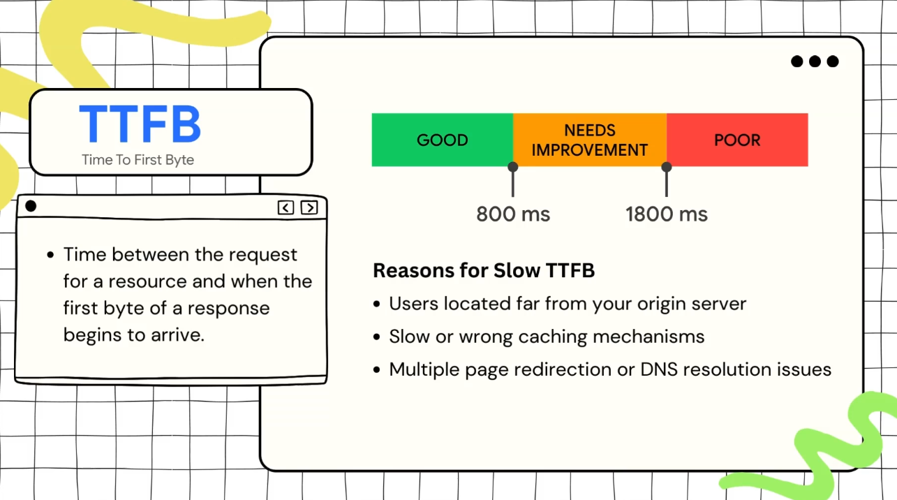
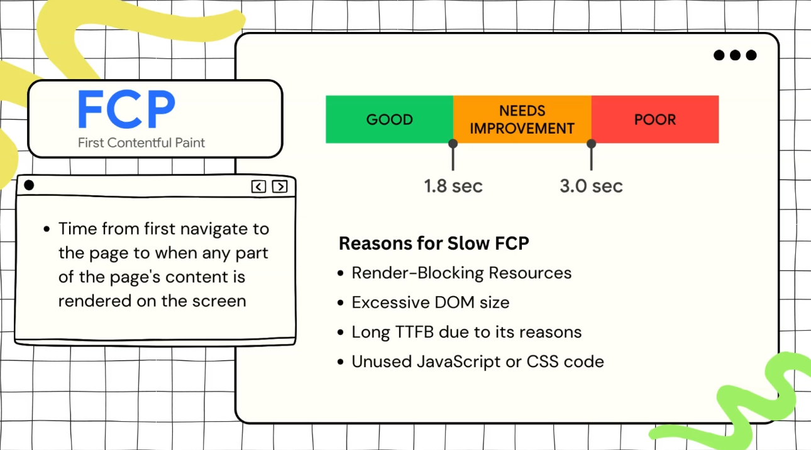

**Web Vitals** are set of quality signals that are used to measure the quality of user experience on the web.

Google selected subset of the web vitals which are **Core Web Vitals** to represent the user experience and **it affects the SEO** ... and they are **LCP, INP, CLS**.

Note that the core web vitals can depend on other metrices.
***
TTFB is the summation of the five steps starting with the redirect until the request. 

One of the solutions for the first problem is to use **CDN**.
***
