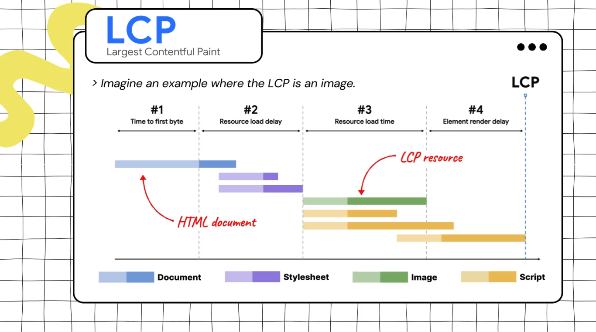

**LCP** is the render time of the largest element visible in the viewport, relative to when the user first navigated to the page.

LCP will only be one of these elements `img, video, image svg, text nodes, bg image` and this decided by google.

Note that during the lifecycle of rendering the page **the LCP is changing**.

Remember that to have a good LCP you need to be less than 2.5 sec but not only this ... **you need this to be the case for 75% of the visitors**.

Remember that LCP **depend on TTFP & FCP**.
***

To remember how to enhance TTFP revision the last lecture.

The main two problems that increase the resource load delay are .. **when the resource is discovered & what priority the resource is given** (as browser assign them a priority) ... and from the solutions to this delay is to **keep the LCP resource hosted on the same origin**.

To reduce resource load time you can **reduce the size of the resource** by **1- serve the optimal image size** ... (don't use 1800 * 1800 image and you will render it in 30 * 30), **2- user modern image formats (e.g. webP)** and **compress images** ... or the second solution is to **reduce the distance the resource has to travel (CDN)**.

The reasons for the **element render delay** might be that we are **waiting for JS code** and from the solutions is that you can **reduce render-blocking style sheets**, **defer render-blocking JS** or **break up long tasks** to free up main thread.

