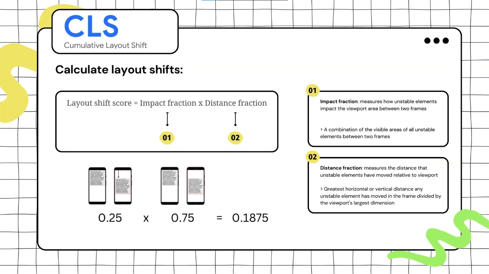

**CLS** measure visual stability because it helps quantify how often users experience unexpected layout shifts .. note that this is just calculated for the elements that was visible and then shifted.

**Main Reasons**:
- Resources load **asynchronous**.
- Dom elements are **dynamically added**.

For example this might happen due to:
1. Image/video with unknown dimensions.
2. Fonts that renders larger or smaller.
3. 3rd ads or iframe. 
***
To calculate the layout shifts the browser uses **session windows** which can be defined as: **one or more layout shifts occur in succession with less than 1s between them, during a maximum period of 5s** .. and the browser takes the window with the highest score. 

To have a good CLS the range should be **from 0.1 to 0.25** and to calculate layout shift:


***
The first problem was about **image/video with unknown dimensions** and you can reduce this problem effect by using **initial width & height** and also use **aspect-ratio** property.

Second problem which is **3rd ads or iframe** can be solved by **preserving space** for the ads, or you can make this ads **render at the bottom of the viewport** so the shift isn't seen to the user, also you can **overlay it on existing content** so it's not part of the document flow and the last solution is that you can make this **layout shift is triggered by the user** so he won't be frustrated about the UX ... and of course you should choose the most appropriate solution to your case.

To solve the third problem which was fonts that renders larger or smaller .. you can use **fallback fonts similar to the web font** or you can **load critical web fonts as early as possible** `<link rel=preload>`

```HTML
<link rel="preload"
      href="/fonts/Inter-400.woff2"
      as="font"
      type="font/woff2"
      crossorigin>
```