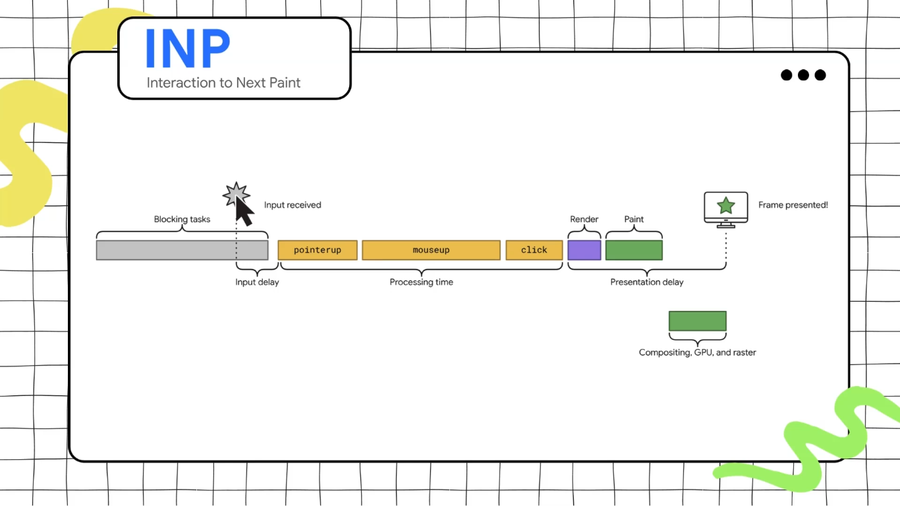

**INP** measure a page's responsiveness to user interactions by observing the latency of all interactions that occur throughout the lifespan of a user's visit ... and the range of INP is **200ms - 500ms**.

**INP** was introduced as a replacement to **FID** which was only measuring the time delay to the **first interaction** only. 

INP only stores **mouse click, touchscreen tap and keystrokes** .. so note that some actions like the hovering and scrolling aren't stored.



**Input delay** is the delay time until the browser finish some blocking tasks, **Processing time** is the time that we need to call the group of event handlers .. and the **Presentation delay** is the time that we need to render the effect to the user.

To optimize the input delay the key factor is to **optimize long tasks** as the long tasks block the main thread .. unlike the case if you have light tasks then the browser can do round-robin technique with them.

The solutions to optimize event callbacks:
- Do as little work as possible in event callback function.
- Break up the work in event callbacks into separate tasks .. `setTimeOut`is one way to break up tasks, because the callback passed to it runs   in a new task.

The next code shows how you can break up the work in event callbacks .. by this code you split heavy work into another task using `setTimeOut(..., 0)`. 

```JS
textBox.addEventListener('input', (inputEvent) => {
  updateTextBox(inputEvent);
  requestAnimationFrame(() => {
    setTimeout(() => {
      const text = textBox.textContent;
      updateWordCount(text);
      checkSpelling(text);
      saveChanges(text);
    }, 0);
  });
});
```

By using `requestAnimationFrame()`:
- You **stop blocking** the event handler.
- The browser can continue toward the **next frame paint**.
- Your code runs at the perfect moment (just before paint).

The solutions to optimize the presentation delay you should **minimize DOM size** and you can achieve this by **lazily render off-screen elements**.


