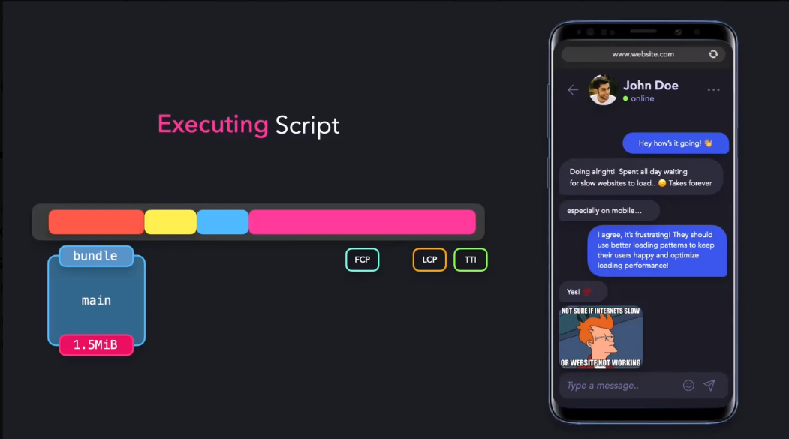

**Web bundlers** are tools that take all your project files (JavaScript, CSS, images, components, etc.) and **combine (bundle) them into fewer optimized files** that run efficiently in the browser.

**What Web Bundlers Do?**

- Combine multiple files into one (or few) bundles.
- Minification .. by removing spaces, comments & unused variables.
- Tree shaking .. If a library has 30 functions but you use only 2, the bundler removes the rest.
- Transpilation .. convert modern JS (ES6+) into older JS for older browsers.
- Code splitting.
- Asset optimization .. optimize and compressing assets for faster loading.
- Hot Module Replacement (HMR) .. when you save a file during development, the bundler updates only that part in the browser without full reload.
***
The steps that the browser go through after loading the main bundle are:
parsing script -> compiling script -> executing script.

As you can see the browsers are very optimized in the parsing & compiling steps .. so the area of improvement will be in loading the main bundle (1st step) and the executing step.

One of the most powerful technique to enhance the performance here is to combine **bundle splitting + lazy loading**.

You can use the coverage tab in the browser to see your resources and the amount of **unused bytes** in each file so you can see what's your candidates for lazy loading.

You have a lot of ways to achieve bundle splitting in your web bundler but for example in WebPack there's three different ways: **entry**, **prevent duplication & dynamic import** ... and the dynamic import way is the most common one.

One of the perfect use cases for bundle splitting is to split your routes into different bundles .. **Angular does route-based bundle splitting automatically**, as long as you use **lazy-loaded routes**.

You should think carefully for each case before implementing bundle splitting as for some cases maybe you shouldn't implement it.
