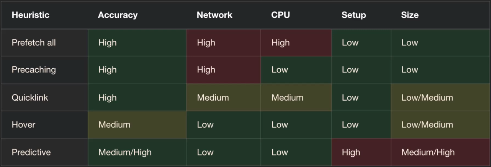

**Prefetch** is used to initiate a **low-priority request** for a resource likely to be used for future navigations that may or may not happen ... so we download and cache resources **relying on assumptions** for the user's behavior.

```HTML
<link rel="prefetch" href="/pages/next-page.html" />
<link rel="prefetch" href="/js/emoji-picker.js" />
```

You can also use **prefetch using HTTP header** ... and there's more advanced approaches like **service workers** and **custom means such as through Webpack**.

We have different prefetching strategies, and they have their trade-offs .. a few dimensions we need to consider between them are: **accuracy, network usage, CPU usage, setup cost and implementation size**.



**Prefetch all** -> Prefetching everything.

**Precaching** -> Just the same as prefetch all but to reduce the load on the main thread we **moved the task to service workers** to run in the background so we reduced the load on the CPU.

**Quicklink** -> Just prefetch all the visible resources to the user using intersection observer.

**Hover** -> Just load the resource when the user hover on a resource ... using the information that the user usually takes around 40-400ms to interact after hovering.

**Predictive** -> It's like a ML model to predict the user navigation .. like the library `guess.js`