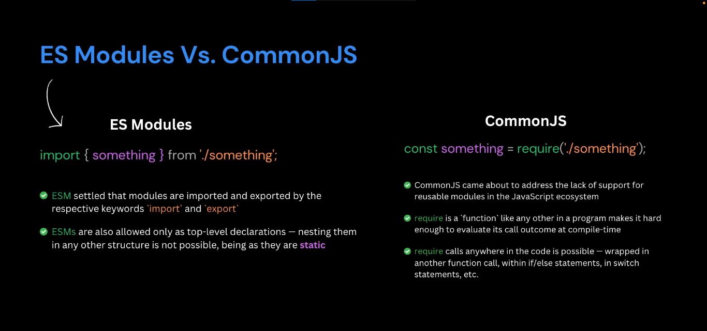

**Tree Shaking** aimed at removing code that will never be used to reduce the size of your JS bundles ... so it's like a tree and we analyze the dependencies to see the parts of the code that aren't used and also there's no used code that depend on it.

Tree shaking is **part of the build process and performed by bundlers**.

Note that tree shaking only works with ECMAScript modules.

```JS
const router = require('./router'); // Won't Tree Shake
import router from './router'; // Tree Shake
```



Note that **default import/export is not tree shakable**, import only what you need from a module.

As you can see most of the work is done by the bundlers ... so our target is to write tree-shakable code to help bundlers ... writing tree-shakable code means to write a code that's **side effect free** ... side effect free means modules that take predictable inputs and produce equally predicable outputs without modifying anything outside of their own scope.

So you should make sure your code is side-effect free or inform the bundler that your app is side-effect free or inform the bundler about files that have side-effects. 


