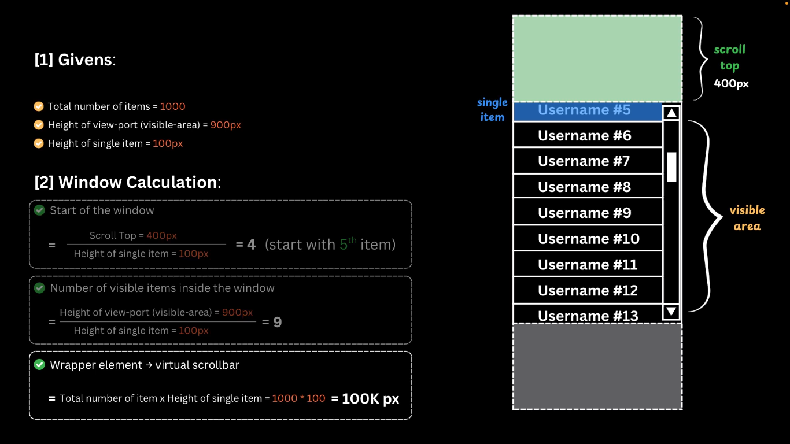
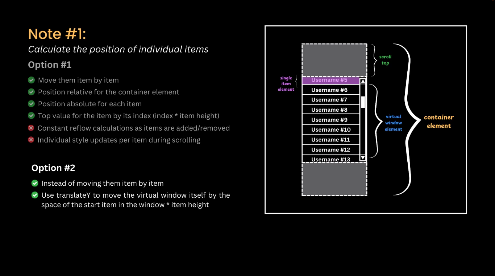

The problem which **virtual scrolling** is trying to solve is that we might have a large list of items what we want to render in our UI.

Key problems with rendering large lists:
- **High memory usage**
- **Slow initial rendering** and **unresponsive UI**
- **Laggy scrolling** .. as there's operations that happens when you are scrolling like recalculation.

**Virtual Scrolling** will only **display the currently visible items** on the screen instead of rendering all items at once.

Note that in the calculations we assumed that all the elements will have fixed size, but if size of the elements is variable we will need to use **estimation function** and there's a lot of libraries that implement this idea.

Also note that if the user scrolled fast will have empty space before new items are rendered and displayed ... this can be solved easily by **Overscan/Buffering** which says that we will render additional items above and below beyond what user can currently see to avoid empty space.

Virtual scrolling **pros**:
- Reduced memory usage
- Faster rendering and smoother updates
- Responsive scrolling, even with thousands of items

Virtual scrolling cons:
- Complexity
- Maintenance 
- Accessibility
- SEO Impact

