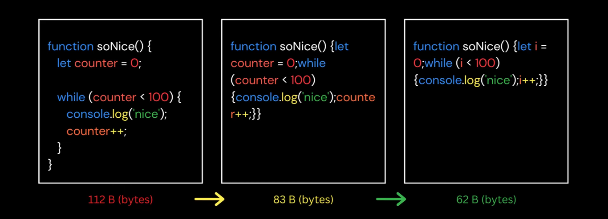
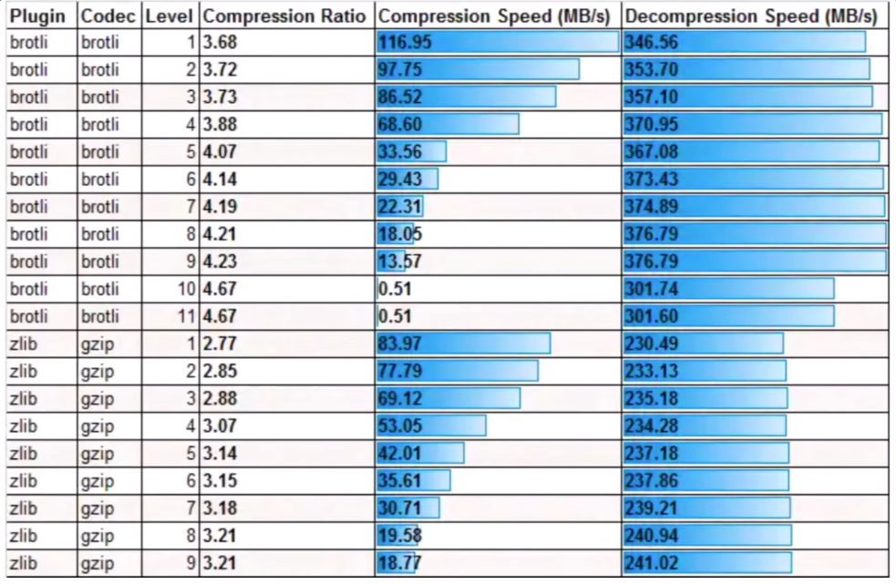

## Compression Intro & Types

JavaScript is the **second biggest contributor to page size** and the most requested web resource on the internet after images.

**Minification** means removing whitespaces and any unnecessary code to create a smaller **but perfectly valid code file**.

This can be done by:
- Removing comments
- Removing unnecessary whitespaces
- Removing unused code
- Optimizing expressions and statements

There's also a step called **Mangling** which is a part of the minification process and it means to **shortening identifier names**.

Lossless compression is the opposite to this as the **output after compression is the same** ... some example to this is **PNG images** ... and this type of compression is **applied in compression your HTML, CSS and JS files**.

There's also two other types of compression which are **static & dynamic** compression.

**Static Compression** **pre-compress resources** and save them ahead of time as part of the build process .. and it **can afford to use higher compression levels**.

**Dynamic Compression** **takes place on the fly** so it's done by the server like the **HTTP proxy tools (e.g. APACHE, NGINX)** and this easier to implement but you are **restricted to using lower compression levels**. 

It's preferable to use dynamic compression with content that changes frequently.

## Compression Algorithms

### Gzip

- The most widely used compression format
- It builds on top of the Deflate algorithm (LZ77 + Huffman)

LZ77 **Identifies duplicate strings** and replace them **with a backreference**.

Huffman **Identifies common refs** and replaces them with **shorter bit seq**.
### Brotli

Google introduces brotli in 2015.

Brotli is enhanced more than Gzip even it's implemented by the same idea.

So as you can see brotli gives better results so it's recommended to use it.

## Trade-off

Compressing one large chunk will yield a better result or smaller file ... so if you have two many bundles compression will be less effective.

Smaller-sized chunks result in better caching efficiency -> if there's a code change, only the affected chunks need to be re-downloaded.
